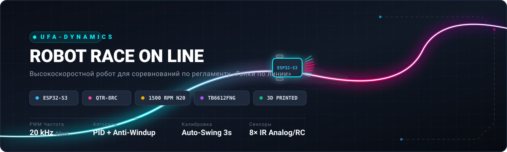
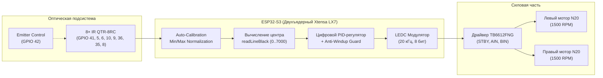

<div align="center">



# 🏎️ Robot Race on Line — Ufa-Dynamics

**Высокоскоростной спортивный робот для соревнований в категории «Гонки по линии» (Line Follower)**

[](https://www.espressif.com/)
[](https://www.arduino.cc/)
[](https://www.pololu.com/product/961)
[](https://aliexpress.com)
[](https://www.pololu.com/product/713)
[](LICENSE)

[🇷🇺 Русский](README.md) • [🇬🇧 English](README_EN.md)

</div>

---

## 📌 О проекте

Репозиторий содержит полный исходный код прошивки и 3D-модели скоростного робота для соревнований по регламенту **«Гонка по линии»** (Line Follower / Robot Race), разработанного участником робототехнической команды **Ufa-Dynamics**.

Проект спроектирован для достижения максимальной скорости и стабильности прохождения трассы за счёт применения производительного микроконтроллера **ESP32-S3**, аппаратного ШИМ с частотой 20 кГц, линейки из 8 инфракрасных датчиков **QTR-8RC**, цифрового PID-регулятора с защитой от насыщения (anti-windup) и интеллектуального алгоритма распознавания линии в условиях низкого контраста.

---

## ✨ Ключевые особенности

- ⚡ **Вычислительное ядро ESP32-S3**:
  - Высокая частота обработки цикла управления без задержек.
  - Аппаратный ШИМ **LEDC на частоте 20 кГц** (ESP32 Arduino Core 3.x) обеспечивает бесшумную, плавную и отзывчивую работу моторов без высокочастотного писка.
- 🎯 **Цифровой PID-регулятор**:
  - Плавное руление на прямых и агрессивное удержание в крутых виражах.
  - Встроенный **Anti-Windup** интегратора предотвращает перерегулирование при резких манёврах.
- 🔄 **Автоматическая калибровка «Auto-Swing»**:
  - При включении робот самостоятельно покачивается над линией в течение ~3 секунд, калибруя динамический диапазон каждого из 8 фотоприёмников под текущее полотно и внешнее освещение.
- 🔍 **Адаптивный алгоритм для сложных и выцветших треков**:
  - Определение наличия линии базируется не только на абсолютной яркости, но и на анализе перепада контраста (`contrast = maxVal - minVal`).
  - Уверенное удержание даже на старых, потёртых или серых баннерных трассах.
- 🛟 **Интеллектуальная система спасения (Recovery Mode)**:
  - При сходе с трассы робот запоминает знак последней зарегистрированной ошибки и выполняет быстрый доворот в сторону потерянной линии (до 1.5 сек), возвращаясь на траекторию.
- 🔘 **Управление и безопасность через кнопку BOOT**:
  - Старт заезда по кнопке с программным антидребезгом.
  - Мгновенное отключение и повторный запуск моторов на лету без перезагрузки контроллера.
- 🖨️ **3D-печатное облегченное шасси**:
  - В комплекте STL-файлы шасси, регулируемого держателя датчиков и переходников под детали LEGO.
- 💻 **Инженерный симулятор компоновки ([simulator/](simulator/))**:
  - Интерактивное React + Electron приложение для подбора идеальной базы, диаметра и ширины колес, оборотов мотора, питания и тестирования реального кода Arduino / C++ до сборки робота в железе.

---

## 🏗️ Архитектура системы



---

## 🔌 Распиновка подключения (Pinout)

### 1. Драйвер двигателей TB6612FNG

| Пин драйвера | Пин ESP32-S3 | Описание / Функция |
| :--- | :--- | :--- |
| **STBY** | `GPIO 12` | Выход из дежурного режима (Standby = HIGH) |
| **PWMA** | `GPIO 13` | Скорость мотора A (Левый) — ШИМ 20 кГц |
| **AIN1** | `GPIO 14` | Направление мотора A |
| **AIN2** | `GPIO 15` | Направление мотора A |
| **PWMB** | `GPIO 16` | Скорость мотора B (Правый) — ШИМ 20 кГц |
| **BIN1** | `GPIO 18` | Направление мотора B |
| **BIN2** | `GPIO 17` | Направление мотора B |

### 2. Линейка датчиков Pololu QTR-8RC

| Датчик | Пин ESP32-S3 | Примечание |
| :---: | :---: | :--- |
| **1 (Крайний левый)** | `GPIO 41` | RC-выход датчика 1 |
| **2** | `GPIO 5` | RC-выход датчика 2 |
| **3** | `GPIO 6` | RC-выход датчика 3 |
| **4 (Центр лево)** | `GPIO 10` | RC-выход датчика 4 |
| **5 (Центр право)** | `GPIO 9` | RC-выход датчика 5 |
| **6** | `GPIO 36` | RC-выход датчика 6 |
| **7** | `GPIO 35` | RC-выход датчика 7 |
| **8 (Крайний правый)** | `GPIO 8` | RC-выход датчика 8 |
| **LEDON (Emitter)** | `GPIO 42` | Включение/выключение ИК-диодов |

### 3. Кнопки и интерфейс

| Элемент | Пин ESP32-S3 | Режим работы |
| :--- | :--- | :--- |
| **Кнопка BOOT** | `GPIO 0` | Вход с подтяжкой к питанию (`INPUT_PULLUP`). Нажатие = LOW |

---

## 🧮 Алгоритм PID-регулирования

Управляющее воздействие вычисляется классическим PID-регулятором на основе ошибки отклонения от центральной точки ($3500$ для массива из 8 датчиков):

$$e(t) = \text{position} - 3500$$

$$u(t) = K_p \cdot e(t) + K_i \int e(t)\,dt + K_d \cdot \frac{de(t)}{dt}$$

```c
float error = (float)position - 3500.0f;
integral += error;
integral = constrain(integral, -10000.0f, 10000.0f); // Anti-windup
float derivative = error - lastError;

float correction = Kp * error + Ki * integral + Kd * derivative;
lastError = error;

int leftSpeed  = constrain((int)(BASE_SPEED + correction), MIN_SPEED, MAX_SPEED);
int rightSpeed = constrain((int)(BASE_SPEED - correction), MIN_SPEED, MAX_SPEED);
```

### Предустановленные коэффициенты:
| Параметр | Значение | Описание |
| :--- | :---: | :--- |
| **`BASE_SPEED`** | `190` | Базовая скорость хода по прямой (из 255) |
| **`MAX_SPEED`** | `255` | Максимальный ШИМ для двигателей |
| **`Kp`** | `0.07` | Пропорциональный коэффициент (сила реакции на смещение) |
| **`Ki`** | `0.0002` | Интегральный коэффициент (устранение статической ошибки) |
| **`Kd`** | `1.2` | Дифференциальный коэффициент (демпфирование раскачки) |

---

## 🖨️ 3D-Печать и механика

Файлы деталей доступны в корне репозитория в формате `.stl`:

| 3D Модель | Описание | Рекомендуемый материал |
| :--- | :--- | :---: |
| [`robotlinia.stl`](robotlinia.stl) | Основное несущее шасси робота под установку платы, батареи и двигателей | PETG / ABS / PLA |
| [`Sensor8rc mount.stl`](<Sensor8rc mount.stl>) | Кронштейн крепления планки сенсоров QTR-8RC на оптимальной высоте (3-5 мм над полом) | PLA / PETG |
| [`legomount.stl`](legomount.stl) | Универсальный адаптер под LEGO элементы (оси, колеса или кронштейны) | PETG / Tough PLA |

### Рекомендации по печати:
- **Высота слоя:** `0.16 мм` – `0.20 мм`
- **Периметры (стенки):** не менее `3–4`
- **Заполнение (Infill):** `35–50%` (Grid / Gyroid)
- **Температурный режим:** в зависимости от используемого филамента (для PETG: сопло ~235°C, стол ~75°C).

---

## 🚀 Сборка и запуск

### Требования к окружению
1. **Arduino IDE 2.x** или **VS Code + PlatformIO**.
2. Установленный пакет плат **ESP32 by Espressif Systems** (версия `>= 3.0.0`, т.к. используется современный API `ledcAttach`).
3. Библиотека **[QTRSensors](https://github.com/pololu/qtr-sensors-arduino)** (версия `4.0.0` или новее).

### Инструкция:
1. Клонируйте репозиторий:
   ```bash
   git clone https://github.com/hegoleg/robot-race-on-line-Ufa-Dynamics.git
   ```
2. Откройте файл [`LineFollowerv3.ino`](LineFollowerv3.ino) в Arduino IDE.
3. В меню **Инструменты -> Плата** выберите плату ESP32-S3 (например, `ESP32S3 Dev Module`).
4. Подключите плату по USB и загрузите прошивку.

### Порядок действий на треке:
1. **Калибровка**: Поставьте робота на трассу так, чтобы линия проходила под центральной частью сенсоров. Подайте питание.
2. Робот выполнит серию покачиваний влево и вправо (~3 секунды), считывая белый фон и черную линию.
3. **Ожидание старта**: После завершения калибровки робот перейдет в режим ожидания.
4. **Старт**: Нажмите кнопку **BOOT** (GPIO 0) — робот начнет движение по регламенту соревнований.
5. **Стоп**: Повторное нажатие кнопки **BOOT** моментально выключает моторы.

---

## 💻 Инженерный симулятор робота ([simulator/](simulator/))

Для подбора идеальной компоновки до сборки в пластике и металле в проект включен интерактивный симулятор физики и реального Arduino C++ кода:
- 🏎️ **Настройка компоновки шасси**: колесная база (мм), радиус и ширина колес, коэффициент сцепления шин, масса робота, обороты моторов (RPM), напряжение батареи (3.7V – 14.8V) и КПД драйвера.
- 📐 **Конфигурация планки датчиков**: от 3 до 16 датчиков, настраиваемый шаг (мм), высота и вынос вперед относительно оси колес.
- 💻 **C++ / Arduino движок**: исполнение реального кода регулятора со встроенным распознаванием `readLineBlack`, persistent-состоянием PID и таймингом `millis()`.
- 📊 **Телеметрия и осциллограф в реальном времени**: живые графики ошибки трекинга, скорости (км/ч) и ШИМ моторов.
- 🔴 **Монитор сенсорной планки QTR**: наглядная шкала отражения каждого фотоприемника с динамическим указателем центроида линии.
- 🏁 **Набор соревновательных трасс**: «Восьмерка», «Овал», «Острые углы 90°», «Слалом» и «Шпилька 180° с шиканой», автоматический хронометраж и фиксация рекордов круга.
- ⏱️ **Управление временем**: регулятор скорости симуляции (0.5x, 1.0x, 2.0x, 5.0x).
- 📥 **Экспорт в .ino в один клик**: генерация чистого скетча для Arduino IDE с полной документацией подобранной геометрии в шапке.

```bash
cd simulator
npm install
npm run dev          # Запуск веб-версии
npm run electron:dev # Запуск десктопного приложения Electron
npm run build        # Сборка готового инсталлятора Windows (.exe)
```

---

## 📁 Структура репозитория

```plaintext
robot-race-on-line-Ufa-Dynamics/
├── assets/
│   └── banner.svg             # Графический баннер репозитория
├── .github/
│   └── ISSUE_TEMPLATE/        # Шаблоны баг-репортов и предложений
├── simulator/                 # Симулятор компоновки и C++ алгоритмов
│   ├── src/                   # Движок физики, компилятор C++, UI компоненты
│   ├── package.json           # Зависимости (React, Vite, Electron, Monaco Editor)
│   └── vite.config.ts
├── LineFollowerv3.ino         # Основная прошивка (ESP32-S3, PID, калибровка)
├── robotlinia.stl             # 3D-модель основного шасси
├── Sensor8rc mount.stl        # 3D-модель кронштейна датчиков QTR-8RC
├── legomount.stl              # 3D-модель переходника под компоненты LEGO
├── .gitignore                 # Игнорируемые файлы сборки и IDE
├── LICENSE                    # Лицензия MIT
├── README.md                  # Документация на русском языке
└── README_EN.md               # English documentation
```

---

## 👥 Команда и авторство

- **Разработчик**: [Egor (hegoleg)](https://github.com/hegoleg)
- **Команда**: **Ufa-Dynamics** (Уфа, Россия)
- Вопросы и предложения можно оставлять в разделе [Issues](https://github.com/hegoleg/robot-race-on-line-Ufa-Dynamics/issues).

---

## 📄 Лицензия

Проект распространяется под открытой лицензией [MIT](LICENSE). Вы можете свободно использовать, модифицировать и собирать робота на базе данных исходных материалов.
