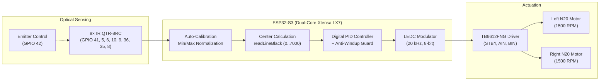

<div align="center">


# 🏎️ High-Speed Line Follower Robot — Ufa-Dynamics

**Autonomous competitive racing robot engineered for Line Follower tournaments**

[](https://www.espressif.com/)
[](https://www.arduino.cc/)
[](https://www.pololu.com/product/961)
[](https://aliexpress.com)
[](https://www.pololu.com/product/713)
[](LICENSE)

[🇷🇺 Русский](README.md) • [🇬🇧 English](README_EN.md)

</div>

---

## 📌 Overview

This repository contains the complete firmware codebase and 3D printable mechanical design files for an autonomous high-speed **Line Follower** robot developed by a team member of **Ufa-Dynamics**.

Engineered for competitive racing, the robot leverages the processing power of the **ESP32-S3** microcontroller, 20 kHz ultrasonic PWM frequency, an 8-channel **QTR-8RC** infrared reflectance sensor array, a tuned digital PID controller with Anti-Windup guard, and an adaptive low-contrast line detection algorithm.

---

## ✨ Key Features

- ⚡ **ESP32-S3 High Performance Core**:
  - Blazing fast control loop execution with zero jitter.
  - **20 kHz LEDC hardware PWM** (ESP32 Arduino Core 3.x) for smooth, silent motor control without audible coil whine.
- 🎯 **Advanced Digital PID Controller**:
  - Smooth high-speed tracking on straight segments and sharp correction in tight corners.
  - **Anti-Windup protection** on the integrator term prevents overshoot during sharp turns.
- 🔄 **Autonomous "Auto-Swing" Calibration**:
  - On startup, the robot autonomously oscillates back and forth over the line (~3 seconds), calibrating the full dynamic range for all 8 phototransistors according to track surface and ambient lighting.
- 🔍 **Adaptive Contrast Detection for Worn Tracks**:
  - Evaluates line presence using dynamic peak-to-peak contrast spread (`contrast = maxVal - minVal`) alongside minimum thresholds.
  - Reliably maintains tracking even on weathered, low-contrast, or gray banner tracks.
- 🛟 **Intelligent Recovery Mode**:
  - If the line is temporarily lost at extreme speeds, the algorithm recalls the sign of the last registered tracking error and spins in place back toward the track (up to 1.5s timeout).
- 🔘 **BOOT Button UI & Safety Control**:
  - Debounced single-button control on GPIO 0: click to launch, click again to immediately cut motor power.
- 🖨️ **3D-Printable Lightweight Chassis**:
  - Ready-to-print STL files for the chassis, adjustable sensor array mount, and LEGO modular adapters.

---

## 🏗️ System Architecture



---

## 🔌 Hardware Pinout

### 1. TB6612FNG Motor Driver

| Driver Pin | ESP32-S3 GPIO | Description / Function |
| :--- | :--- | :--- |
| **STBY** | `GPIO 12` | Standby enable (Active HIGH) |
| **PWMA** | `GPIO 13` | Motor A Speed (Left) — 20 kHz PWM |
| **AIN1** | `GPIO 14` | Motor A Direction input 1 |
| **AIN2** | `GPIO 15` | Motor A Direction input 2 |
| **PWMB** | `GPIO 16` | Motor B Speed (Right) — 20 kHz PWM |
| **BIN1** | `GPIO 18` | Motor B Direction input 1 |
| **BIN2** | `GPIO 17` | Motor B Direction input 2 |

### 2. Pololu QTR-8RC Sensor Array

| Channel | ESP32-S3 GPIO | Description |
| :---: | :---: | :--- |
| **Sensor 1 (Far Left)** | `GPIO 41` | RC timing pin |
| **Sensor 2** | `GPIO 5` | RC timing pin |
| **Sensor 3** | `GPIO 6` | RC timing pin |
| **Sensor 4 (Center Left)** | `GPIO 10` | RC timing pin |
| **Sensor 5 (Center Right)** | `GPIO 9` | RC timing pin |
| **Sensor 6** | `GPIO 36` | RC timing pin |
| **Sensor 7** | `GPIO 35` | RC timing pin |
| **Sensor 8 (Far Right)** | `GPIO 8` | RC timing pin |
| **LEDON (Emitter)** | `GPIO 42` | IR LED array gating |

### 3. User Controls

| Component | ESP32-S3 GPIO | Mode |
| :--- | :--- | :--- |
| **BOOT Button** | `GPIO 0` | `INPUT_PULLUP` (Active LOW) |

---

## 🧮 Control Loop & PID Tuning

The steering effort is computed from the line deviation error relative to setpoint $3500$:

$$e(t) = \text{position} - 3500$$

$$u(t) = K_p \cdot e(t) + K_i \int e(t)\,dt + K_d \cdot \frac{de(t)}{dt}$$

```c
float error = (float)position - 3500.0f;
integral += error;
integral = constrain(integral, -10000.0f, 10000.0f); // Anti-windup
float derivative = error - lastError;

float correction = Kp * error + Ki * integral + Kd * derivative;
lastError = error;

int leftSpeed  = constrain((int)(BASE_SPEED + correction), MIN_SPEED, MAX_SPEED);
int rightSpeed = constrain((int)(BASE_SPEED - correction), MIN_SPEED, MAX_SPEED);
```

### Tuned Parameters:
| Constant | Value | Role |
| :--- | :---: | :--- |
| **`BASE_SPEED`** | `190` | Nominal forward speed (0–255 range) |
| **`MAX_SPEED`** | `255` | Upper limit for PWM duty cycle |
| **`Kp`** | `0.07` | Proportional gain (immediate response to error) |
| **`Ki`** | `0.0002` | Integral gain (eliminates steady-state offset) |
| **`Kd`** | `1.2` | Derivative gain (dampens oscillation and corrects rate of change) |

---

## 🖨️ 3D Printing & Mechanical Files

STL files are located in the repository root:

| 3D Model | Description | Recommended Filament |
| :--- | :--- | :---: |
| [`robotlinia.stl`](robotlinia.stl) | Main robot chassis with cutouts for motor brackets, battery, and boards | PETG / ABS / PLA |
| [`Sensor8rc mount.stl`](<Sensor8rc mount.stl>) | QTR-8RC sensor mount (calibrated for 3–5 mm ground clearance) | PLA / PETG |
| [`legomount.stl`](legomount.stl) | Universal adapter for standard LEGO axles and wheels | PETG / Tough PLA |

### Recommended Slicer Settings:
- **Layer Height:** `0.16 mm` – `0.20 mm`
- **Perimeters / Walls:** `3–4`
- **Infill:** `35–50%` (Gyroid or Grid)
- **Support:** Optional (designed with minimal overhangs)

---

## 🚀 Getting Started

### Prerequisites
1. **Arduino IDE 2.x** or **VS Code + PlatformIO**.
2. **ESP32 by Espressif Systems** core package (`>= 3.0.0` required for the updated `ledcAttach` API).
3. **[QTRSensors](https://github.com/pololu/qtr-sensors-arduino)** library (`v4.0.0`+).

### Flashing the Firmware:
1. Clone the repository:
   ```bash
   git clone https://github.com/hegoleg/robot-race-on-line-Ufa-Dynamics.git
   ```
2. Open [`LineFollowerv3.ino`](LineFollowerv3.ino) in Arduino IDE.
3. Select your ESP32-S3 board (e.g., `ESP32S3 Dev Module`).
4. Connect via USB-C and hit **Upload**.

### Race Operation Workflow:
1. **Calibration**: Place the robot over the track with the line centered under the sensors. Power on.
2. The robot swings left and right autonomously for ~3 seconds, recording background and line reflectance.
3. **Standby**: The robot stops and waits for user confirmation.
4. **Launch**: Press the **BOOT** button (GPIO 0) to start the race.
5. **Emergency Stop**: Press **BOOT** at any time to instantly brake the motors.

---

## 📁 Repository Structure

```plaintext
robot-race-on-line-Ufa-Dynamics/
├── assets/
│   └── banner.svg             # Repository banner and vector assets
├── .github/
│   └── ISSUE_TEMPLATE/        # Bug reports & feature requests templates
├── LineFollowerv3.ino         # Main robot firmware
├── robotlinia.stl             # 3D chassis model
├── Sensor8rc mount.stl        # 3D sensor array mount model
├── legomount.stl              # 3D LEGO adapter model
├── .gitignore                 # Build and IDE ignore patterns
├── LICENSE                    # MIT License
├── README.md                  # Russian documentation
└── README_EN.md               # English documentation
```

---

## 👥 Authors & Team

- **Developer**: [Egor (hegoleg)](https://github.com/hegoleg)
- **Team**: **Ufa-Dynamics** (Ufa, Russia)
- Feel free to open an [Issue](https://github.com/hegoleg/robot-race-on-line-Ufa-Dynamics/issues) for feedback and inquiries.

---

## 📄 License

This project is licensed under the [MIT License](LICENSE).
